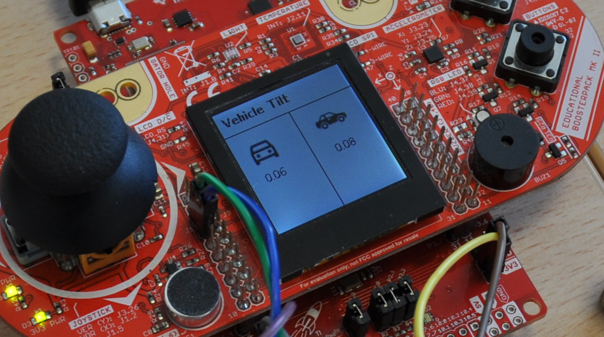
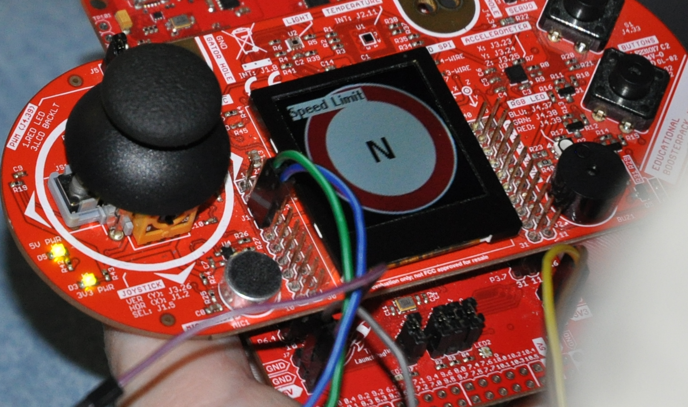

# Car Dashboard
Final project for Embedded Systems for the Internet of Things  [UniTn - 145996]

## Description
Enhance your driving experience with this advanced car dashboard, meticulously crafted using an MSP432P401R microcontroller for precise calculations and an ESP32 for seamless internet connectivity. Harness the power of real-time location data from a GPS module to retrieve current speed limits, empowering you to stay informed and maintain responsible driving practices.

## Showcase Video
You can find the demo video [here](https://movies.prabo.org/MeTube/w?code=9j3-g6hEDcr)

#### Key Features:

- __Accurate Speed Limit Display__: Leverage GPS-acquired latitude and longitude to fetch local speed limits from online databases, ensuring compliance and enhancing road safety.
- __Intuitive User Interface__: Visually appealing and user-friendly interface that clearly displays essential information like current speed, speed limit, location name, and more.



## Usage

CarDBoard has a 4-tab graphical user interface. By moving the joystick to the left or to the right you will be able to view the following tabs:

- __Speed Limit__: a street sign showing the speed limit of the road being travelled
- __Vehichle speed__: Speed of the vehicle and a colored indicator to know whether the car is below or above the speed limit
- __Tilt__: car tilting below the x-axis or the y-axis according to the sensor on the Boosterpack board
- __Geolocation__: real time visualization of the geographic coordinates (latitude and longitude)




## Hardware Components:

- __MSP432P401R__: This powerful microcontroller forms the heart of the project, performing calculations and handling core operations.
- __BoosterPack MKII__: Plug-in module for the MSP432 providing an LCD screen, Joystick, Buttons and various sensors. 
- __ESP32__: Equipped with Wi-Fi and Bluetooth connectivity, the ESP32 establishes internet access to retrieve speed limit data.
- __GPS Module__: Accurately determine your location (latitude and longitude) to fetch corresponding speed limits from online databases.

## Software Overview:

- C Code for MSP432: code to control the MSP432, process sensor data, and manage calculations.
- Arduino or PlatformIO for ESP32: code using Arduino to enable Wi-Fi connection, interact with online databases, and retrieve speed limit data.

## Project Structure
```
├─── msp
|    ├─── src
|         ├─── display
|         ├─── esp
|         ├─── firmware
|         ├─── tilt
├─── osm
```

### Libraries 
- GrLib
- DriverLib
- TinyGPS++
- ArduinoJson

### APIs
- __Overpass Turbo__:   
    Overpass dives into the vast world of OpenStreetMap (OSM), a freely editable map built by communities worldwide.  
    You send it a specific "search warrant" (called a query) based on your GPS location.  
    It scours the digital map, looking for specific clues, like road signs or tags containing speed limit information.
    If it finds a match, it sends back that information as a coded message (JSON format).

- __Nominatim__:  
    Translating between the real world and digital addresses, it plays a crucial role in understanding your location and its surroundings.
    Nominatim speaks the language of both maps and addresses.  
    You feed it an address, like a street name and city, or even just coordinates.
    It delves into the vast database of OSM, searching for matching locations.  
    If it finds a match, it responds with a wealth of information, including:
    - Place name and details
    - Nearby points of interest
    - And more, depending on the data available

### Useful documentation
- [DriverLib](https://schaumont.dyn.wpi.edu/ece4703b21/_downloads/7a8fc22c23fd2706dfd4d3f5256fad98/msp432-driverlib-user.pdf)
- [Joystick](https://www.ti.com/lit/ug/slau599b/slau599b.pdf?ts=1698864546827&ref_url=https%253A%252F%252Fwww.ti.com%252Ftool%252FBOOSTXL-EDUMKII)
- [Overpass Turbo](https://overpass-turbo.eu/)
- [Reverse Geocoding for OpenStreetMap](https://nominatim.org/release-docs/develop/api/Reverse/)

### Contributions
- [Filippo De Grandi](mailto:filippo.degrandi@studenti.unitn.it?subject=Embedded-project-infos) ([@Degra02](https://github.com/Degra02/)):  
    Led project setup and initial configuration.  
    Developed graphical user interfaces for speed limit, speed, and geolocation sections.  
    Created API for dynamic screen updates based on ESP32 data.

- [Lorenzo Bodini](mailto:lorenzo.bodini@studenti.unitn.it?subject=Embedded-project-infos) ([@topongo](https://github.com/topongo/)):  
    Migrated early stage of MSP codebase to a more organized structure, based on plug-and-play modules.
    Worked on the ESP32 code, in particular:
    - UART communication with the MSP module and the creation of custom queries for the Overpass-Turbo API;
    - WiFi and GPS connectivity, using integrated WiFi module on the ESP32, a mobile hotspot and an external GPS module.
    Planning to upgrade the WiFi connectivity to a SIM module, for GSM based networking, to avoid mobile hotspots.
    Created the showcase video.

- [Lorenzo Pattaro Zonta](mailto:lorenzo.pattarozonta@studenti.unitn.it?subject=Embedded-project-infos) ([@lyreplus](https://github.com/lyreplus/)):  
    Developed and tested the tilt functionality utilizing the Booster Pack's accelerometer. Established an appropriate input range.
    Designed and implemented a dedicated tilt graphics page for intuitive user interaction.
    Established and integrated UART communication protocol on the MSP board, in collaboration with the other members of the team.

- [Elia Zonta](mailto:elia.zonta@studenti.unitn.it?subject=Embedded-project-infos) ([@eliazonta](https://github.com/eliazonta/)):  
    Developed connection between ESP32 board and OpenStreetMap API throught Nominatim reverse geocoding to retrieve required informations to be sent to the MSP board.
    Initially worked on a UART comminication between MSP board and the GPS module that later on has been switched to the ESP32 making easier the implementation and requiring less communication overhead in the MSP board.
    Created the presentation slides.

